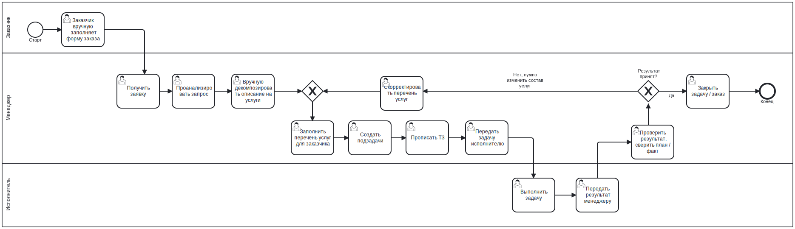
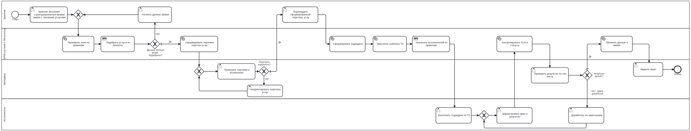

## Текущий процесс

Процесс полностью завязан на менеджера — он является узким местом процесса.
Время тратится не на выполнение работ, а на анализ, создание задач, передачу между участниками.

- Перечень услуг не типизирован, заказчик может указать любые услуги. Нет каталога услуг.
- Менеджер вручную обрабатывает заявку, вместо работы по шаблонам типовых услуг.
- Декомпозиция услуг, создание подзадач и ТЗ выполняются вручную, что повыше риск ошибок. Нет автоматической предварительной декомпозиции заказа по типовым услугам.
- Нет шаблонов ТЗ исполнителям.
- Проверка результата совмещена с изменением состава услуг и происходит после выполнения работ, из-за чего ошибки выявляются поздно.

## Оптимизированный процесс

В предлагаемом процессе часть ручных операций менеджера переносится в BPM-систему на основе ИИ-агента и структурированных данных:

- Система проверяет заявку, подбирает услуги из каталога, формирует черновик перечня услуг, создаёт подзадачи, подставляет шаблоны ТЗ и назначает исполнителей.
- Менеджер не обрабатывает заказ с нуля, а проверяет результат автоматической подготовки и контролирует исключения.

### Улучшения

| Узкое место                        | Улучшение                                                            |
| ---------------------------------- | -----------------------------------------------------------------    |
| Свободная форма заказа             | Структурированная форма и каталог типовых услуг                      |
| Ручная обработка заявки менеджером | Автоматическиея проверка формы и подбор услуг                        |
| Ручная декомпозиция заказа         | Автоматическое формирование перечня услуг и подзадач                 |
| Ручное создание ТЗ                 | Шаблоны ТЗ для типовых задач                                         |
| Передача задач через менеджера     | Автоматическое назначение исполнителей по бизнес-правилам            |
| Ошибки выявляются поздно           | Проверка перечня услуг до начала работ, результата — по чек-листу    |
| План/факт контролируется в конце   | Автоматическое обновление данных в BPM-системе после закрытия заказа |

### Ожидаемый эффект

* сокращение времени обработки заказа ~20%;
* снижение трудозатрат менеджера ~50%;
* уменьшение количества ошибок и доработок ~50%.

### Требуемые ресурсы

* BPM-система с ИИ-агентом;
* каталог услуг и шаблоны ТЗ;
* бизнес-аналитик и администратор системы.

Оценка трудозатрат: 180–240 человеко-часов.

### График внедрения

| Этап                                 | Срок       |
| ------------------------------------ | ---------- |
| Анализ текущего процесса             | 1 неделя   |
| Проектирование целевого процесса     | 1 неделя   |
| Подготовка каталога услуг и шаблонов | 1–2 недели |
| Настройка системы                    | 2 недели   |
| Пилотный запуск                      | 2 недели   |
| Полноценный запуск                   | 1 неделя   |

Общий срок внедрения: около 8 недель.
